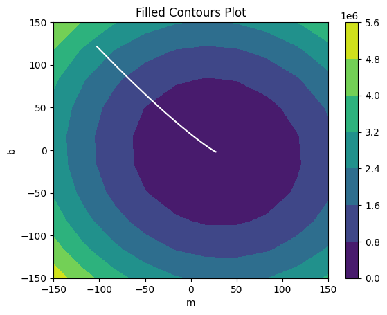
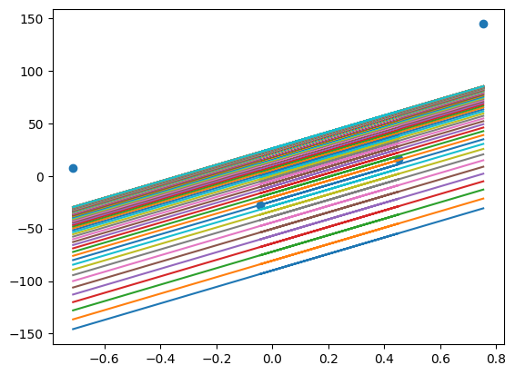
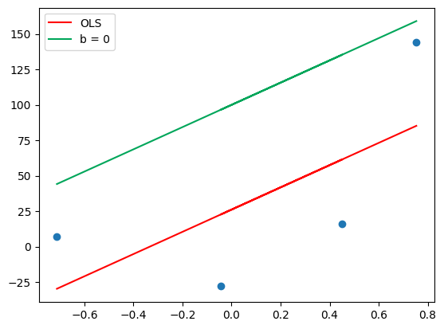

# 🧠 Gradient Descent from Scratch – A Hands-On Journey

This notebook is a complete walkthrough of how Gradient Descent works — from the basics to intuitive visualizations.

It started as a simple exploration of gradient descent, but quickly grew into a deep dive into how the algorithm really behaves. I implemented it in multiple forms — from basic loops to 3D visualizations — to not just make it work, but to truly understand the why behind every step.

---

## 🚀 What You’ll Find Inside

### 🔹 Version 1 – Manual, Loop-Based Gradient Descent
- A straightforward, raw implementation that loops through each data point
- Great for building intuition about gradients and loss functions

### 🔹 Version 2 – Vectorized Gradient Descent
- Cleaner and faster implementation using NumPy
- Includes a live loss curve to track learning progress

### 🔹 Version 3 – 3D Gradient Descent Visualization
- Visualizes how gradient descent works over a 3D surface:  
  `z = sin(5x) * cos(5y)/5`
- You’ll see the optimization path in real time

---

## 📊 Sample Outputs

### 🌀 Gradient Descent Path on Contour Plot

### 📈 Gradient Line Updates during Descent

### 📏 OLS vs Baseline Comparison

## 🔗 Want to Try It?

Just click the badge at the top to run the notebook directly in Google Colab — no setup needed.

---

## 💡 Why I Made This

I wanted to build more than just working code — I wanted to create something **explorable** and **teachable**.  
This notebook helped me reinforce:
- The math behind gradients
- Why vectorization matters in real-world ML
- How visualizations can make abstract concepts click

---

## 🛠 Built With

- Python & NumPy  
- Matplotlib for visualization  
- A lot of curiosity and debugging

---

## 🧠 What’s Next?

- Extend this to multivariable regression  
- Add stochastic and mini-batch variants  
- Maybe even animate gradient flow using `matplotlib.animation`

---

Thanks for checking this out! Feel free to fork, run, or reach out if you’re working on something similar 🙌
